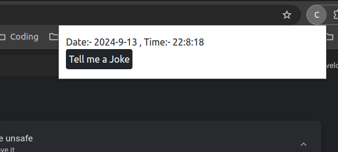
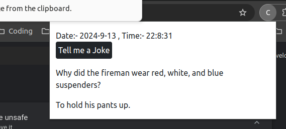

# Joke Generator Chrome Extension

A simple Chrome extension that generates a random joke every time the user clicks the **Tell me a Joke** button. This extension also displays the current date and time at the top of the app. 

## Features

- **Joke Generation**: Click the button to generate a new joke.
- **Date & Time Display**: Shows the current date and time at the top of the extension.
- **Simple & Lightweight**: Built with HTML, CSS, and JavaScript, with Bootstrap 5 for basic styling.

## Installation

1. Clone or download this repository to your local machine.
2. Open Chrome and go to `chrome://extensions/`.
3. Enable **Developer mode** by toggling the switch in the top right corner.
4. Click on **Load unpacked** and select the directory where you cloned/downloaded this repository.

The extension should now be installed and accessible from your Chrome toolbar!

## Usage

1. Open the extension by clicking its icon in the Chrome toolbar.
2. The current date and time will be displayed at the top.
3. Click on the **Tell me a Joke** button to generate a new joke.

## Technologies Used

- **HTML**: For the structure of the extension.
- **CSS**: For styling the elements.
- **JavaScript**: For handling the joke generation and date/time display functionality.
- **Bootstrap 5**: For quick and responsive styling.

## Screenshots

## File Structure

- **manifest.json**: Chrome extension configuration file.
- **index.html**: Main HTML file for the popup.
- **style.css**: CSS file for styling.
- **script.js**: JavaScript file for functionality.
  
## Credits

This extension was created by Bilal Ahmed.

## License
opensource
